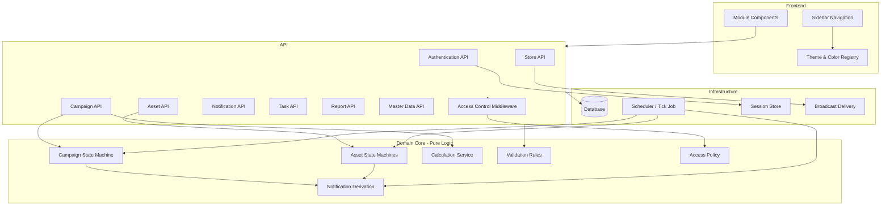
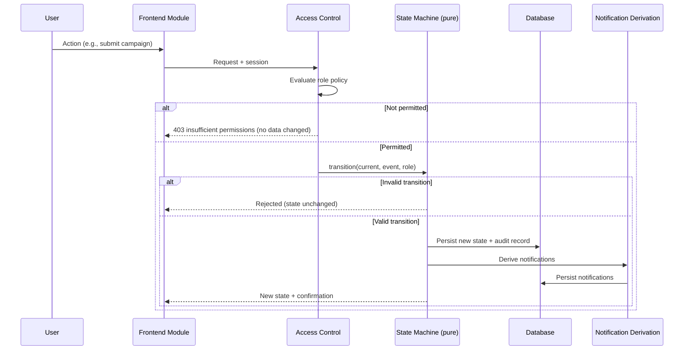
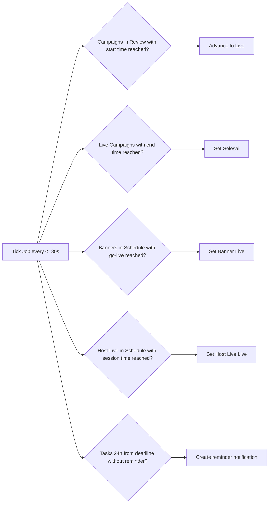
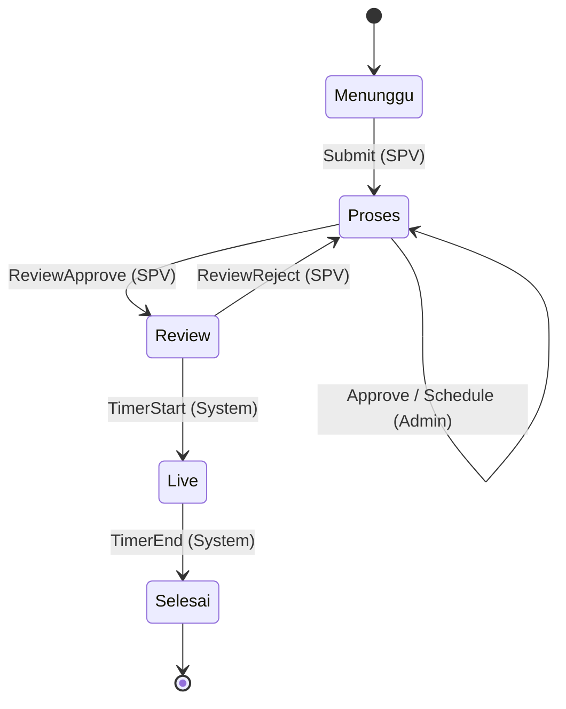
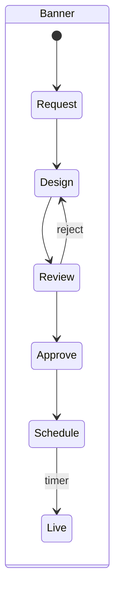
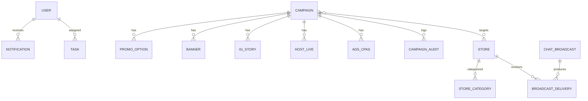

# Design Document

## Overview

CampaignHub (Promo Management) is a marketplace campaign management web application that coordinates the full lifecycle of promotional campaigns and their supporting assets (banners, Instagram stories, host live sessions, and CPAS ads). The application serves two roles — SPV (Supervisor) and Admin — with role-based access control governing every module and action.

The design centers on three pillars:

1. **Deterministic state machines** for the Campaign lifecycle and each Asset workflow, with strict transition integrity and full audit logging. These are pure functions over `(currentState, event, actorRole)` that either yield a new state plus side effects or a rejection.
2. **A pure Calculation_Service** that derives total cost, margin, and NPM from `Campaign_Scheme` inputs, isolated from I/O so it can be exhaustively property-tested.
3. **A modular, component-based frontend** organized one module per sidebar tab, presented in Bahasa Indonesia using a light-mode pastel minimalistic visual system with a shared color registry for `Campaign_Status` and `Campaign_Category`.

The architecture deliberately separates **pure domain logic** (state transitions, calculations, validation, access decisions, notification derivation) from **infrastructure** (persistence, authentication, scheduling, delivery). This separation is what makes the system amenable to property-based testing: the domain core can be exercised across thousands of generated inputs without touching a database or network.

### Design Goals

- Correctness of lifecycle transitions and calculations is the top priority — invalid transitions must be impossible to commit, and `Selesai` (Done) must be terminal.
- Time-triggered transitions (campaign go-live/end, banner go-live, host live start, deadline reminders) must be processed within 60 seconds.
- The UI must remain responsive: validation within 500 ms, preview updates within 1 second, module switches within 2 seconds.
- Role permissions must be enforced server-side as the source of truth, with the sidebar reflecting the same rules client-side.

### Technology Choices

The design is implementation-language-agnostic at the contract level but assumes a typical web stack to make the components concrete:

- **Frontend**: A component-based SPA framework (e.g., React) with a typed state layer. Drag-and-drop sliders for `Promo_Option` editing, a calendar view library for month/week/day rendering, and a charting library for reports.
- **Backend**: A typed API service exposing REST/RPC endpoints, with the domain core as a framework-independent module.
- **Persistence**: A relational database for campaigns, assets, stores, tasks, notifications, audit logs, and master data. Relational integrity supports the master-data reference checks in Requirement 20.
- **Scheduler**: A periodic job (tick interval ≤ 30 seconds to guarantee the 60-second SLA) that evaluates due time-triggered transitions and reminder notifications.

> Research note: the requirements specify hard timing budgets (60 s for scheduled transitions, 500 ms validation, 1 s preview). A polling scheduler with a tick interval at or below half the SLA (≤ 30 s) is the simplest design that reliably meets the 60-second guarantee without requiring exact-time cron precision. This is the standard "interval well below deadline" approach for soft real-time guarantees.

## Architecture

### Layered Architecture



### Request Flow (representative)



### Scheduler Architecture

A single periodic tick (≤ 30 s interval) drives all time-triggered behavior so the 60-second SLA in Requirements 8.6, 8.7, 11.6, 13.5 is met:



Each scheduled transition runs through the **same** pure state-machine functions as user-initiated transitions, with the acting party recorded as "System" in the audit log (Requirement 9.3).

### Module Composition

Each sidebar entry maps to one self-contained module component. Exactly one module renders in the main content area at a time (Requirement 3.3). Shared cross-cutting pieces:

- **Sidebar_Navigation**: fixed-left, role-filtered entry list, single active highlight.
- **Theme/Color Registry**: single source of truth mapping each `Campaign_Status` and `Campaign_Category` to one pastel color, consumed identically by Dashboard, Calendar, and all module views (Requirements 23.3, 23.4).
- **Validation Engine**: shared field-constraint evaluator used by every form for the 500 ms validation guarantee (Requirement 22.1).

## Components and Interfaces

### Access_Control_Service

Server-side authority for permissions; the sidebar mirrors its decisions client-side.

```
type Role = "SPV" | "Admin"
type Action =
  | "CreateScheme" | "SubmitCampaign" | "ReviewExecution" | "ApproveCampaign"
  | "SetStrategy" | "CalculateCampaign" | "PrepareAsset" | "ExecuteTask" | "UpdateProgress"
  | ... (per-module actions)

interface AccessPolicy {
  isPermitted(role: Role | null, action: Action): boolean
  permittedModules(role: Role | null): ModuleId[]
}
```

Policy map (from Requirement 2):
- **SPV**: CreateScheme, SubmitCampaign, ReviewExecution, ApproveCampaign, plus shared read modules.
- **Admin**: SetStrategy, CalculateCampaign, PrepareAsset, ExecuteTask, UpdateProgress, plus shared read modules.
- **null / no role**: nothing (Requirement 2.4).

When a request is denied, the API performs no part of the action and leaves all data unchanged (Requirement 2.3), returning an insufficient-permissions error.

### Campaign State Machine

Pure function governing `Campaign_Status` and `Campaign_Step`.

```
type CampaignStatus = "Menunggu" | "Proses" | "Review" | "Live" | "Selesai"
type CampaignStep   = "BuatSkema" | "Submit" | "Eksekusi" | "Review" | "Live"

type CampaignEvent =
  | { kind: "Submit", actor: Role }
  | { kind: "Approve", actor: Role }          // Admin, after calculation
  | { kind: "Schedule", actor: Role, start, end }
  | { kind: "ReviewApprove", actor: Role }    // SPV approves execution
  | { kind: "ReviewReject", actor: Role }     // SPV rejects execution
  | { kind: "TimerStart" }                    // scheduled go-live (System)
  | { kind: "TimerEnd" }                      // scheduled end (System)

type TransitionResult =
  | { ok: true, status: CampaignStatus, step: CampaignStep, effects: Effect[] }
  | { ok: false, reason: string }             // state unchanged

function transition(state: CampaignState, event: CampaignEvent): TransitionResult
```

Defined transitions (the only legal ones):

| From (status, step) | Event | To (status, step) | Source |
|---|---|---|---|
| Menunggu, BuatSkema | Submit (SPV) | Proses, Submit | R6.1 |
| Proses, Submit | Approve (Admin, calc done) | Proses, Eksekusi | R8.1 |
| Proses, Eksekusi | ReviewApprove (SPV) | Review, Review | R8.5 |
| Proses, Eksekusi | Schedule (Admin) | Proses, Eksekusi (schedule recorded) | R8.3 |
| Review, Review | TimerStart | Live, Live | R8.6 |
| Live, Live | TimerEnd | Selesai, Live | R8.7 |
| Review/Eksekusi | ReviewReject (SPV) | Proses, Eksekusi | R8.8 |

Any event not listed for the current state returns `{ ok: false }` with the state unchanged (Requirements 9.2, 9.4). `Selesai` has no outgoing transitions (Requirement 9.4). Every successful transition emits an `AuditRecord` effect (Requirement 9.3) and any notification effects (Requirements 6.2, 8.8).



### Asset State Machines

Each asset type has its own pure transition function with the same shape. Valid status sets are closed (Requirements 11.10, 12.5, 13.8, 14).

**Banner** (R11): `Request → Design → Review → Approve → Schedule → Live`
- Reject in Review → back to Design + Admin notification (R11.7).
- Schedule requires future go-live (R11.9); go-live timer sets Live (R11.6).

**IG Story** (R12): `Request → Design → Approve`
- Reject in Design → stays Design + Admin notification (R12.4).
- Design upload requires a file (R12.7).

**Host Live** (R13): `Request → Design → Approve → Schedule → Live`
- Schedule requires future session time (R13.7); session timer sets Live (R13.5).
- Reject in Design → stays Design + Admin notification (R13.6).

**Ads CPAS** (R14): `Request → Design → Approve → Setup_Complete`
- Setup requires all config fields (R14.5); reject in Design → stays Design + notification (R14.6).



All asset machines require an associated existing Campaign at creation (R11.8, R12.6, R13.1, R14.1).

### Calculation_Service

Pure, deterministic, I/O-free — the prime PBT target.

```
interface SchemeInputs {
  baseRevenue: number          // >= 0
  baseCost: number             // >= 0
  promoOptions: PromoOption[]  // 1..20, each discountPct in 0..100 step 1
  additionalCosts: number      // >= 0
}

interface CalculationResult {
  totalCost: number
  margin: number               // revenue - totalCost
  npm: number | "undefined"    // margin / revenue, "undefined" when revenue == 0
  warning: boolean             // true when npm < 0 or npm == "undefined" (R7.5)
}

function calculate(inputs: SchemeInputs): CalculationResult
```

- `totalCost = baseCost + additionalCosts + sum(per-promo cost derived from discountPct applied to baseRevenue)`.
- `margin = effectiveRevenue - totalCost`.
- `npm = margin / effectiveRevenue` when `effectiveRevenue > 0`, else `"undefined"` (R7.5).
- `warning` is set when NPM is negative or undefined (R7.5).
- Non-numeric or out-of-range inputs are rejected upstream by validation, retaining the previous value (R7.6).

Recompute on input edit within 1 second (R7.2); initial compute within 3 seconds (R7.1).

### Notification Derivation

Pure function mapping domain events to notifications, ensuring exactly-one semantics and dedup.

```
function notificationsFor(event: DomainEvent, recipients: User[]): Notification[]
```

- Approval-required state → exactly one notification per responsible user (R17.1).
- Asset status change → notification to responsible SPV/Admin users (R17.4).
- Deadline reminder at exactly 24h-before, created at most once per task deadline (R17.2, R17.3) — dedup keyed by `(taskId, deadline)`.
- Unread count = number of user notifications in unread state (R17.6); marking read sets state and the derived count decreases by one (R17.7).

### Store Management & Chat Broadcast

```
interface BroadcastRequest {
  message: string         // 1..1000 chars
  storeIds: StoreId[]     // 1..500 stores
}
interface BroadcastResult {
  perStore: { storeId: StoreId, status: "delivered" | "failed" }[]
}
```

- Stores grouped into mutually exclusive sets: active, non-active, attention-needed (R16.1).
- Assignment is idempotent-guarded: re-assigning an already-assigned campaign is rejected (R16.7).
- Empty store selection rejected, message retained (R16.5).
- Each selected store gets a recorded delivery status; failures recorded and surfaced (R16.4, R16.8).

### Calendar Component

Month (default), week, day views (R15.1–15.3). Color-coded by `Campaign_Category` via the shared registry (R15.4). Multi-day campaigns appear on every day from start through end inclusive (R15.6). Empty period shows empty state (R15.7).

### Validation Engine

Shared evaluator returning `{ field, violationReason }[]`, run within 500 ms of change (R22.1). Drives real-time preview for scheme forms (R22.2) and blocks saves with errors while retaining entered values (R22.3, R22.4).

## Data Models



### Core Entities

```
Campaign {
  id, name (1..100), category: CampaignCategory,
  status: CampaignStatus, step: CampaignStep,
  timelineStart: Date, timelineEnd: Date,
  scheduledStart?: DateTime, scheduledEnd?: DateTime,
  scheme: CampaignScheme,
  calculation?: CalculationResult,
  targetStoreIds: StoreId[] (>=1),
  createdAt, updatedAt
}

CampaignScheme {
  promoOptions: PromoOption[] (1..20)
}

PromoOption {
  id, label, discountPct: int (0..100, step 1)
}

CampaignAudit {
  id, campaignId, timestamp,
  fromStatus, toStatus, fromStep, toStep,
  actor: UserId | "System"
}

Banner   { id, campaignId, status: BannerStatus, design?, goLiveAt? }
IGStory  { id, campaignId, status: IGStoryStatus, design? }
HostLive { id, campaignId, status: HostLiveStatus, sessionAt? }
AdsCPAS  { id, campaignId, status: AdsCPASStatus, adConfig? }

Store {
  id, name, status: "active" | "non-active" | "attention-needed",
  categoryIds: StoreCategoryId[], assignedCampaignIds: CampaignId[]
}

ChatBroadcast { id, message (1..1000), createdAt, senderId }
BroadcastDelivery { id, broadcastId, storeId, status: "delivered" | "failed" }

Notification {
  id, userId, kind: "approval" | "deadline" | "assetStatus",
  refType, refId, message, state: "unread" | "read", createdAt,
  dedupKey?  // for deadline reminders: (taskId, deadline)
}

Task {
  id, userId, title, status: TaskStatus, deadline: DateTime,
  linkedRefType?, linkedRefId?, reminderSent: boolean
}

MasterDataRecord { id, type, uniqueId, fields, referencedBy: Ref[] }

Session { userId, role, lastActivityAt, expiresAt }
```

### Enumerations

```
CampaignStatus   = Menunggu | Proses | Review | Live | Selesai
CampaignStep     = BuatSkema | Submit | Eksekusi | Review | Live
CampaignCategory = FlashSale | BrandDay | Payday | MegaBonus | Weekend | Lokal
BannerStatus     = Request | Design | Review | Approve | Schedule | Live
IGStoryStatus    = Request | Design | Approve
HostLiveStatus   = Request | Design | Approve | Schedule | Live
AdsCPASStatus    = Request | Design | Approve | Setup_Complete
```

### Color Registry

A single map assigns one distinct pastel color to each of the five `Campaign_Status` values and each of the six `Campaign_Category` values, with no shared colors within a set (R23.3) and identical rendering across modules (R23.4).

## Correctness Properties

*A property is a characteristic or behavior that should hold true across all valid executions of a system — essentially, a formal statement about what the system should do. Properties serve as the bridge between human-readable specifications and machine-verifiable correctness guarantees.*

The criteria reduce to a focused set of generic properties applied across the state machines, access policy, calculation service, validation engine, notification derivation, and presentation derivations. Per the prework reflection, per-criterion transition rules are consolidated into reusable per-machine properties.

**Access Control**

### Property 1: Permission decisions match the policy exactly
*For any* role (SPV, Admin, or none) and *any* action, `isPermitted(role, action)` returns true if and only if the action is in that role's permitted set; an unauthenticated/no-role principal is permitted nothing.
**Validates: Requirements 1.3, 1.7, 2.1, 2.2, 2.4**

### Property 2: Denied actions cause no state change
*For any* domain state and *any* (role, action) where the action is not permitted, executing the request leaves all affected data byte-for-byte unchanged and performs no partial effect.
**Validates: Requirements 2.3**

### Property 3: Sidebar and dashboard data reflect only permitted scope
*For any* role, the set of sidebar modules shown equals exactly the permitted-module set (no extras, none omitted), and dashboard campaigns/tasks/approvals/notifications are restricted to that role's permitted scope.
**Validates: Requirements 2.5, 4.5**

**Session**

### Property 4: Inactivity expiry is exact
*For any* `lastActivity` timestamp and current time `now`, a session is treated as expired if and only if `now - lastActivity >= 30 minutes`.
**Validates: Requirements 1.5**

### Property 5: Lockout after five consecutive failures
*For any* sequence of authentication attempts for one account, the account is locked if and only if there have been 5 consecutive failures and the current time is within the 15-minute window following the fifth failure; a success resets the counter.
**Validates: Requirements 1.6**

**Campaign State Machine**

### Property 6: Defined transitions yield the specified target
*For any* campaign state and *any* event defined for that state, the transition produces exactly the `(status, step)` pair specified in Requirements 6 and 8 (Submit→Proses/Submit; Approve→Proses/Eksekusi; ReviewApprove→Review/Review; TimerStart→Live/Live; TimerEnd→Selesai; ReviewReject→Proses/Eksekusi).
**Validates: Requirements 6.1, 8.1, 8.5, 8.6, 8.7, 8.8**

### Property 7: Undefined transitions are rejected with state unchanged
*For any* campaign state and *any* event not defined for that state, the transition is rejected and the campaign's status and step remain unchanged.
**Validates: Requirements 6.4, 9.2**

### Property 8: Status is always one of the five legal values
*For any* sequence of events applied to a campaign, its status is always exactly one of Menunggu, Proses, Review, Live, Selesai.
**Validates: Requirements 9.1**

### Property 9: Selesai is terminal
*For any* event applied to a campaign in status Selesai, the status remains Selesai.
**Validates: Requirements 9.4**

### Property 10: Every successful transition is audited
*For any* successful campaign transition, an audit record is produced containing the timestamp, the previous status/step, the resulting status/step, and the acting user identity (or "System" for timer-triggered transitions).
**Validates: Requirements 9.3**

### Property 11: Approval requires completed calculation
*For any* campaign, an Approve event succeeds only if total cost, margin, and NPM have been computed; otherwise it is rejected and the state is unchanged.
**Validates: Requirements 8.2**

### Property 12: Submission requires a complete scheme
*For any* campaign whose scheme is missing one or more required fields, a Submit event is rejected, the campaign remains at Menunggu, and every missing field is reported.
**Validates: Requirements 6.3**

**Asset State Machines (Banner, IG Story, Host Live, Ads CPAS)**

### Property 13: Asset creation requires an existing associated campaign
*For any* asset-request event, the asset is created with status Request and bound to an existing campaign; a request without a valid associated campaign is rejected.
**Validates: Requirements 11.1, 11.8, 12.1, 12.6, 13.1, 14.1**

### Property 14: Defined asset transitions yield the specified next status
*For any* asset and *any* event defined for its current status, the transition produces exactly the next status specified for that asset type (Banner Request→Design→Review→Approve→Schedule→Live; IG Story Request→Design→Approve; Host Live Request→Design→Approve→Schedule→Live; Ads CPAS Request→Design→Approve→Setup_Complete).
**Validates: Requirements 11.2, 11.3, 11.4, 11.5, 11.6, 12.2, 12.3, 13.2, 13.3, 13.4, 13.5, 14.2, 14.3, 14.4**

### Property 15: Undefined asset transitions are rejected within a closed status set
*For any* asset and *any* event not defined for its current status, the transition is rejected, the status is unchanged, and the status is always within that asset type's closed value set.
**Validates: Requirements 11.10, 12.5, 13.8**

### Property 16: Rejection routes back and notifies
*For any* asset rejected by an SPV, the asset moves to its specified post-rejection status (Banner Review→Design; IG Story stays Design; Host Live stays Design; Ads CPAS stays Design) and exactly one notification is created for the Admin role describing the rejection.
**Validates: Requirements 11.7, 12.4, 13.6, 14.6**

### Property 17: Future-time guard on scheduling
*For any* schedule event, the transition succeeds only if the scheduled time is strictly later than the current time; otherwise it is rejected and the asset stays in Approve.
**Validates: Requirements 11.9, 13.7**

### Property 18: Setup and upload completeness guards
*For any* Ads CPAS setup with one or more required configuration fields missing, the setup is rejected, the asset stays in Approve, and each missing field is reported; *for any* IG Story design upload without a file, the upload is rejected and the status is retained.
**Validates: Requirements 14.5, 12.7**

**Calculation Service**

### Property 19: Calculation matches the cost/margin/NPM formula
*For any* valid scheme inputs, `calculate` returns `totalCost`, `margin = effectiveRevenue - totalCost`, and `npm = margin / effectiveRevenue` when revenue > 0, or `"undefined"` when revenue is zero.
**Validates: Requirements 7.1**

### Property 20: Calculation is deterministic (idempotent recompute)
*For any* scheme inputs, computing the result twice yields identical results.
**Validates: Requirements 7.2**

### Property 21: Warning flag iff NPM is negative or undefined
*For any* scheme inputs, the warning indicator is set if and only if the resulting NPM is negative or undefined (zero revenue).
**Validates: Requirements 7.5**

**Validation Engine**

### Property 22: Acceptance iff all constraints satisfied, with complete violation reporting
*For any* form value set, the save is accepted if and only if every field satisfies its constraints; when rejected, every violated field is reported with its reason, and all entered values are retained.
**Validates: Requirements 5.3, 5.4, 5.5, 7.6, 8.4, 18.6, 20.4, 20.5, 21.4, 22.1, 22.3, 22.4**

### Property 23: New valid scheme starts at Menunggu / BuatSkema
*For any* scheme satisfying all constraints, the persisted campaign begins with status Menunggu and step BuatSkema.
**Validates: Requirements 5.6**

### Property 24: Promo option count never exceeds twenty
*For any* scheme, adding a promo option when 20 are already present is rejected, and the promo-option count is always between 1 and 20 for a valid scheme; each discount percentage is an integer in 0..100.
**Validates: Requirements 5.2, 5.7, 5.3**

### Property 25: Real-time preview is a pure function of current values
*For any* scheme form state, the rendered preview is fully determined by the current field values (equal values produce equal previews).
**Validates: Requirements 22.2**

**Notifications**

### Property 26: Triggering events create exactly one notification per recipient
*For any* event requiring approval or signalling an asset status change, exactly one notification is created for each responsible user, identifying the item and the action/new status.
**Validates: Requirements 6.2, 8.8, 17.1, 17.4**

### Property 27: Deadline reminders fire once at 24h before, with dedup
*For any* task with a deadline, when the current time reaches 24 hours before the deadline exactly one reminder is created, and no further reminder is ever created for that same task deadline regardless of how many ticks occur.
**Validates: Requirements 17.2, 17.3**

### Property 28: Unread count equals the number of unread notifications
*For any* set of a user's notifications, the unread count equals the number whose state is unread.
**Validates: Requirements 17.6**

### Property 29: Marking read decrements by one and is idempotent
*For any* unread notification, marking it read sets its state to read and reduces the unread count by exactly one; marking an already-read notification read leaves the count unchanged.
**Validates: Requirements 17.7**

**Ordering, Filtering, and Aggregation**

### Property 30: Ordering produces a correctly sorted sequence
*For any* collection and *any* supported sort key (deadline, status, calculation columns, recency), the output is a permutation of the input ordered by that key (notifications most-recent-first, tasks earliest-deadline-first, upcoming campaigns start-ascending).
**Validates: Requirements 4.2, 7.3, 17.5, 18.1, 18.2, 19.3**

### Property 31: Filtering returns exactly the matching members
*For any* collection and *any* filter predicate (status, date range overlap), the result contains every member satisfying the predicate and no member that does not.
**Validates: Requirements 7.3, 18.2, 19.2**

### Property 32: Date-range filter rejects inverted ranges
*For any* date range where the end date precedes the start date, the filter is rejected, the previously displayed report is retained, and an invalid-order message is shown.
**Validates: Requirements 19.5**

### Property 33: Group counts are correct and exhaustive
*For any* campaign set, the per-status and per-category counts each sum to the total campaign count and each group count equals the number of members in that group; the same holds for assets grouped by type and status, and for dashboard summary-card counts.
**Validates: Requirements 4.1, 19.1, 19.4**

### Property 34: Bounded lists respect their limits
*For any* dataset, the dashboard upcoming-campaigns list and recent-notifications list each contain at most 10 items, all upcoming campaigns have a start date on or after the current date.
**Validates: Requirements 4.2**

**Workflow Visualization**

### Property 35: Step classification matches the current step
*For any* selected campaign, the active step equals the campaign's current step, every step ordered before it is marked completed, and every step ordered after it is neither active nor completed; the same ordering invariant holds for a banner's stage progress.
**Validates: Requirements 10.2, 10.3, 10.5, 10.6**

### Property 36: Exactly one active module and one active sidebar entry
*For any* navigation sequence, exactly one module is rendered in the main content area and exactly one sidebar entry is marked active.
**Validates: Requirements 3.3, 3.4**

**Calendar**

### Property 37: An item appears on a day iff its schedule overlaps that day
*For any* campaign or scheduled asset and *any* displayed period (month/week/day), the item appears on a given day if and only if that day falls within the item's scheduled timeline inclusive of start and end dates.
**Validates: Requirements 15.1, 15.2, 15.3, 15.6, 8.3, 13.4**

### Property 38: Selected-date detail completeness
*For any* date selected with at least one occurring item, each displayed item shows its name, category, current status, and scheduled timeline.
**Validates: Requirements 15.5**

**Stores**

### Property 39: Store status groups partition the store set
*For any* set of stores, the active, non-active, and attention-needed groups are pairwise disjoint and their union equals the full store set.
**Validates: Requirements 16.1**

### Property 40: Campaign assignment is dedup-guarded
*For any* store and campaign, assigning a campaign already assigned to that store is rejected and the store's assignment set is unchanged; a first-time assignment records the association.
**Validates: Requirements 16.2, 16.7**

### Property 41: Broadcast produces exactly one delivery record per selected store
*For any* valid broadcast (message 1..1000 chars, 1..500 stores), the result contains exactly one delivery record per selected store, each marked delivered or failed, and the surfaced failed set equals the set of stores with failed status; an empty store selection is rejected with the message retained.
**Validates: Requirements 16.4, 16.5, 16.8**

**Master Data**

### Property 42: Referenced records cannot be deleted; unreferenced can
*For any* master-data record, deletion is rejected if and only if the record is referenced by at least one active campaign or asset; when rejected, the referencing items are identified and the record is retained; when unreferenced, deletion removes it.
**Validates: Requirements 20.3, 20.6**

### Property 43: Unique identifiers stay unique
*For any* master-data set, creating or editing a record so its unique identifier duplicates an existing record's identifier is rejected and existing data is unchanged.
**Validates: Requirements 20.4**

**Presentation Color Registry**

### Property 44: Status and category colors are injective within each set
*For any* two distinct `Campaign_Status` values they map to different colors, and *for any* two distinct `Campaign_Category` values they map to different colors.
**Validates: Requirements 23.3**

### Property 45: Color lookup is a pure function of the value
*For any* status or category value, the assigned color is identical regardless of the view (Dashboard, Calendar, or module) in which it is rendered.
**Validates: Requirements 23.4, 15.4**

## Error Handling

The system distinguishes four error categories, each with a consistent handling contract:

1. **Validation errors** (invalid field values, missing required fields, inverted date ranges, out-of-range promo/calculation inputs). The operation is rejected, all user-entered values are retained, and a message identifies each affected field and the reason. No state changes (Requirements 5.4, 5.5, 6.3, 7.6, 8.4, 11.9, 13.7, 14.5, 18.6, 19.5, 20.4, 20.5, 21.4, 22.1, 22.3).

2. **Authorization errors** (action not permitted for the role, unauthenticated access). The operation performs no part of its effect, leaves all data unchanged, and returns an insufficient-permissions/not-authorized message (Requirements 1.7, 2.3, 2.4).

3. **Invalid state-transition errors** (transition not defined for the current state, transition out of a terminal state). The transition is rejected, the current status is retained, and an error indicates the transition is not permitted (Requirements 6.4, 9.2, 9.4, 11.10, 13.8).

4. **Infrastructure/dependency errors** (data retrieval failure, persistence failure, backend unavailable, partial broadcast delivery failure, module load failure). The system retains previously displayed/persisted values, surfaces an error indicating the operation could not be completed, and — for broadcasts — records a per-store failed status and reports the affected stores (Requirements 3.5, 4.6, 7.4-failure, 16.8, 18.7, 21.5).

Cross-cutting rules:
- **Atomicity**: a rejected transition or denied action makes no partial mutation; audit records are written only on successful transitions.
- **Idempotent retries**: scheduled transitions and reminder creation are guarded by dedup keys so re-processing a due item (overlapping ticks) does not double-apply effects (Requirements 17.3).
- **Account lockout**: after 5 consecutive failures the account is locked for 15 minutes and further attempts are denied during the window (Requirement 1.6).

## Testing Strategy

The feature has substantial pure domain logic (state machines, calculation, validation, access policy, notification derivation, ordering/filtering/aggregation, calendar overlap, color registry), so property-based testing applies and is the primary correctness mechanism for the domain core. Infrastructure-bound criteria (auth round trips, persistence timing, CRUD availability, settings rendering) are covered by integration and example tests instead.

### Property-Based Tests

- A property-based testing library appropriate to the implementation language MUST be used (e.g., fast-check for TypeScript, Hypothesis for Python). Property-based testing MUST NOT be implemented from scratch.
- Each correctness property (Properties 1–45 above) MUST be implemented by a single property-based test.
- Each property test MUST run a minimum of 100 iterations.
- Each property test MUST be tagged with a comment referencing its design property, in the format:
  **Feature: campaign-hub, Property {number}: {property_text}**
- Generators MUST cover edge cases inline: empty collections, boundary promo counts (0, 1, 20, 21), zero revenue, negative margins, whitespace/empty strings, inverted date ranges, past/future schedule times, maximum store/message sizes (500 stores, 1000 chars), and all enum values for statuses, steps, and categories.

Generator design highlights:
- **Campaign/asset state generators** produce arbitrary reachable states paired with arbitrary events (both defined and undefined) to exercise transition Properties 6–18, 13–18.
- **Scheme generators** produce promo-option lists across the 0..20 boundary with discount integers in/around 0..100 for calculation and validation Properties 19–24.
- **Notification/task generators** produce arbitrary recipient sets, deadlines, and tick sequences for Properties 26–29.
- **Collection generators** produce arbitrary lists with arbitrary sort/filter keys for Properties 30–34.
- **Store generators** produce arbitrary status partitions and assignment sets for Properties 39–41.

### Unit / Example Tests

Focused example tests cover the EXAMPLE-classified criteria and concrete edge cases:
- Sidebar fixed order and fixed-left layout, single-module navigation examples (Requirements 3.1, 3.2, 3.5).
- Invalid-credentials and sign-out flows (Requirements 1.2, 1.4).
- Dashboard empty-state and selection navigation (Requirements 4.4, 4.7, 18.4, 18.5, 16.6, 19.6, 10.4, 15.7).
- Settings session application and backend-unavailable handling (Requirements 21.3, 21.5).
- Task persist-failure handling (Requirement 18.7).

### Integration Tests (1–3 examples each)

- Authentication establishes/terminates sessions within the timing budget (Requirements 1.1, 1.4).
- Master-data create/edit persistence and form availability (Requirements 20.1, 20.2).
- Settings load and preference persistence (Requirements 21.1, 21.2).
- Inline calculation/task status persistence (Requirements 7.4, 18.3).
- Scheduler tick advances due campaigns/assets and fires reminders within 60 seconds (Requirements 8.6, 8.7, 11.6, 13.5, 17.2) — validated end-to-end with a controllable clock.

### Smoke / Manual Checks

- Bahasa Indonesia text coverage (Requirement 3.6) via i18n lint/manual review.
- Light-mode pastel scheme, legibility, and component-type composition (Requirements 23.1, 23.2) via visual/snapshot review.

### UI Component Tests

Snapshot and interaction tests for module components (drag-and-drop sliders, calendar month/week/day rendering, workflow step diagram, charts) verify presentation structure and color-registry consumption, complementing the pure color-registry Properties 44–45.
