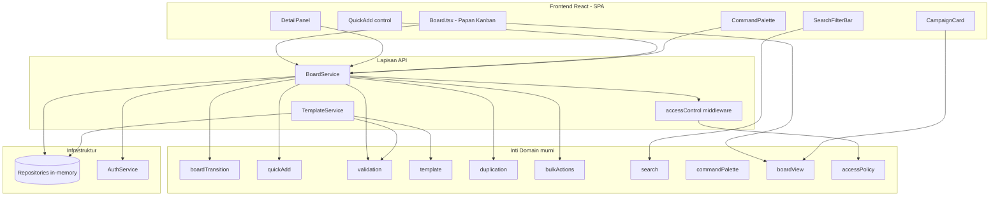
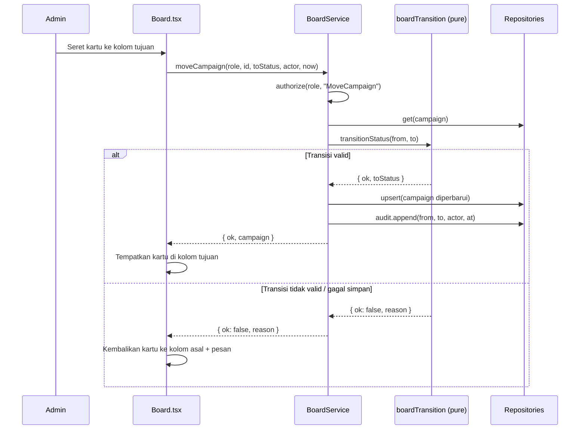
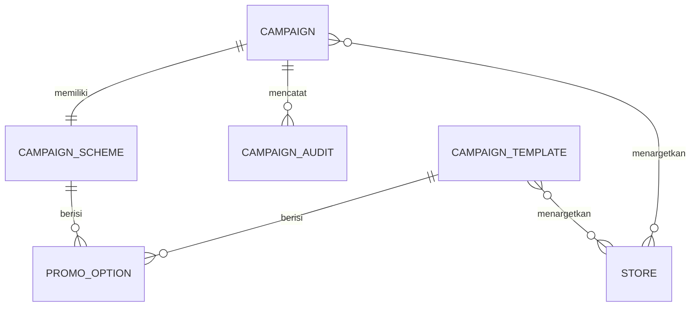

# Design Document

## Overview

Campaign Manager adalah evolusi (pivot) dari CampaignHub. Tujuan utamanya bergeser dari alur persetujuan multi-tahap menjadi **kecepatan input campaign** melalui antarmuka papan Kanban bergaya Trello/ClickUp. Desain ini mempertahankan arsitektur berlapis yang sudah mapan pada basis kode saat ini — inti domain murni (tanpa I/O), lapisan infrastruktur, lapisan API dengan middleware kontrol akses, dan frontend React — sambil menambahkan kemampuan baru yang dituntut oleh kebutuhan: papan Kanban, Tambah Cepat, penyuntingan inline dengan penyimpanan otomatis, panel detail, seret-dan-lepas, template, duplikasi, aksi massal, pencarian/penyaringan, serta palet perintah dan pintasan keyboard.

Keputusan desain kunci adalah memperkenalkan **model transisi status berbasis kedekatan kolom (board transition model)** sebagaimana didefinisikan Requirement 9, yang berbeda dari mesin status berbasis event/step warisan (`campaignStateMachine.ts`). Model baru ini menjadi otoritas tunggal untuk perpindahan status pada papan (seret-dan-lepas dan aksi massal), sementara logika langkah (step) warisan dapat tetap hidup untuk modul Workflow lama tanpa saling mengganggu. Pemisahan ini menjaga integritas siklus hidup (Requirement 9) sebagai satu sumber kebenaran murni yang dapat diuji properti.

Desain mengikuti prinsip yang sudah dianut basis kode:

- **Domain murni dan deterministik**: seluruh aturan bisnis (validasi, transisi, pencarian, duplikasi, aksi massal) adalah fungsi tanpa efek samping yang dapat diuji dengan property-based testing (fast-check, minimal 100 iterasi).
- **Infrastruktur di balik interface stabil**: persistence memakai repository in-memory yang dapat diganti SQL tanpa mengubah pemanggil.
- **API menegakkan kontrol akses di sisi server** melalui `authorize`/`tryAuthorize`, dan UI mencerminkan keputusan yang sama.
- **Frontend SPA React** dengan tema light-mode pastel dan teks Bahasa Indonesia.

### Tujuan Desain

1. Mendukung pembuatan dan pengelolaan campaign dengan jumlah interaksi seminimal mungkin.
2. Menjaga konsistensi siklus hidup status meski perpindahan dilakukan dengan cepat (seret-dan-lepas, aksi massal, palet perintah).
3. Memastikan setiap perubahan tersimpan otomatis dengan umpan balik visual yang jelas dan penanganan kegagalan yang aman (mempertahankan nilai sebelumnya).
4. Menjaga keterpisahan lapisan agar logika bisnis dapat diuji secara independen dari UI dan transport.

## Architecture

### Lapisan Sistem

Arsitektur mempertahankan empat lapisan yang ada, dengan penambahan modul-modul baru yang ditandai (BARU):

```
src/
  domain/        # Inti murni, tanpa I/O
    types.ts                  # Tipe bersama (diperluas: Template, BulkResult, dsb.)
    boardTransition.ts        # (BARU) Model transisi status Kanban (Req 9)
    quickAdd.ts               # (BARU) Validasi & pembuatan Campaign_Draft (Req 3)
    validation.ts             # Validasi field (dipakai ulang untuk inline edit, Req 4/5)
    template.ts               # (BARU) Validasi & instansiasi Template_Campaign (Req 7)
    duplication.ts            # (BARU) Duplikasi campaign independen (Req 8)
    bulkActions.ts            # (BARU) Aksi massal dengan keberhasilan parsial (Req 10)
    search.ts                 # (BARU) Pencarian & penyaringan papan (Req 11)
    commandPalette.ts         # (BARU) Penyaringan perintah (Req 12)
    boardView.ts              # (BARU) Derivasi papan: kolom, kartu, hitungan, warna (Req 2)
    colorRegistry.ts          # Pemetaan warna kategori/status (Req 2.4, 2.5)
    accessPolicy.ts           # Kebijakan peran SPV/Admin (Req 1)
    session.ts                # Kedaluwarsa sesi & lockout (Req 1)
    ...
  infra/
    db/repositories.ts        # Repository (diperluas: TemplateRepository)
    auth/authService.ts       # Autentikasi, sesi, lockout (Req 1)
    ...
  api/
    board.ts                  # (BARU) Endpoint papan: quickAdd, move, inline edit, bulk, search
    template.ts               # (BARU) Endpoint template
    campaign.ts               # Endpoint campaign warisan (tetap)
    middleware/accessControl.ts
  web/
    modules/Board.tsx         # (BARU) Papan Kanban utama
    components/                # Kartu, kolom, panel detail, palet perintah (BARU)
    ...
```

### Diagram Komponen



### Alur Transisi Status (Seret-dan-Lepas)



### Keputusan Arsitektur dan Rasionalnya

1. **Model transisi papan terpisah dari mesin step warisan.** Requirement 9 mendefinisikan transisi murni atas `CampaignStatus` (maju adjacent + mundur adjacent, Selesai terminal). Ini tidak cocok dengan mesin event/step warisan yang menuntut prasyarat (`calculated`, `schemeComplete`). Memperkenalkan `boardTransition.ts` sebagai otoritas Req 9 menghindari pencampuran dua model dan menjadikan integritas siklus hidup dapat diuji properti secara terisolasi.
2. **Memakai ulang `validation.ts`.** Penyuntingan inline (Req 4) dan panel detail (Req 5) memakai validator skema yang sudah ada agar aturan field konsisten di seluruh titik input. Tidak ada duplikasi aturan.
3. **Salinan independen lewat penyalinan struktural mendalam (deep copy).** Template (Req 7.5) dan duplikasi (Req 8.2) menuntut isolasi mutasi. Karena domain murni dan tipe sebagian besar serializable, salinan dilakukan dengan klon mendalam pada `scheme`, `promoOptions`, dan `targetStoreIds`.
4. **Aksi massal mengembalikan laporan parsial.** Req 10.3 menuntut keberhasilan parsial; `bulkActions.ts` mengembalikan ringkasan (berhasil, gagal beserta alasan) tanpa melempar, agar UI dapat menampilkan laporan.
5. **Penyimpanan otomatis di sisi UI dengan kontrak waktu di API.** Indikator "menyimpan/tersimpan/gagal" (Req 4.2, 4.3, 4.5) adalah keadaan UI; API tetap menyediakan operasi sinkron deterministik yang divalidasi sebelum persistence.

## Components and Interfaces

### Domain: `boardTransition.ts` (BARU)

Otoritas tunggal Requirement 9. Murni, tanpa I/O.

```typescript
import { CampaignStatus, EpochMillis, UserId } from "./types.js";

/** Peta Transisi_Valid (Req 9.2): maju adjacent + mundur adjacent. Selesai terminal (Req 9.4). */
export const VALID_TRANSITIONS: Record<CampaignStatus, readonly CampaignStatus[]>;

/** True iff perpindahan from->to adalah Transisi_Valid. from===to dianggap no-op valid (Req 6.4). */
export function isValidTransition(from: CampaignStatus, to: CampaignStatus): boolean;

export interface BoardAudit {
  campaignId: string;
  timestamp: EpochMillis;
  fromStatus: CampaignStatus;
  toStatus: CampaignStatus;
  actor: UserId; // wajib; transisi tanpa pengguna ditolak (Req 9.7)
}

export type StatusTransitionResult =
  | { ok: true; status: CampaignStatus; audit?: BoardAudit }
  | { ok: false; reason: string };

/**
 * Mengevaluasi perpindahan status. Menolak jika: actor tidak ada (Req 9.7),
 * status saat ini Selesai dan tujuan berbeda (Req 9.4), atau bukan Transisi_Valid (Req 9.3).
 * from===to mengembalikan ok tanpa audit (Req 6.4).
 */
export function transitionStatus(
  from: CampaignStatus,
  to: CampaignStatus,
  actor: UserId | null,
  now: EpochMillis,
  campaignId: string,
): StatusTransitionResult;
```

Tabel `VALID_TRANSITIONS`:

| Dari | Tujuan valid |
|------|--------------|
| Menunggu | Proses |
| Proses | Review, Menunggu |
| Review | Live, Proses |
| Live | Selesai, Review |
| Selesai | (tidak ada) |

### Domain: `quickAdd.ts` (BARU)

Requirement 3. Validasi nama (trim 1..100) dan pembuatan Campaign_Draft.

```typescript
import { Campaign, CampaignCategory, EpochMillis } from "./types.js";

export const QUICK_ADD_NAME_MIN = 1;
export const QUICK_ADD_NAME_MAX = 100;

export type QuickAddResult =
  | { ok: true; campaign: Campaign }
  | { ok: false; reason: string };

/**
 * Membuat Campaign_Draft dari nama. Memangkas spasi awal/akhir; menolak jika
 * panjang setelah pemangkasan 0 (Req 3.4) atau > 100 (Req 3.5). Status awal
 * Menunggu, kategori default netral, daftar promo/toko kosong (draft).
 */
export function createDraft(
  rawName: string,
  now: EpochMillis,
  defaultCategory: CampaignCategory,
  id?: string,
): QuickAddResult;
```

### Domain: `template.ts` (BARU)

Requirement 7. Validasi batas (1..50 promo, 1..1000 toko, kategori wajib) dan instansiasi salinan independen.

```typescript
import { CampaignCategory, EpochMillis, PromoOption, StoreId, Campaign } from "./types.js";

export const TEMPLATE_MIN_PROMOS = 1;
export const TEMPLATE_MAX_PROMOS = 50;
export const TEMPLATE_MIN_STORES = 1;
export const TEMPLATE_MAX_STORES = 1000;

export interface CampaignTemplate {
  id: string;
  name: string;
  category: CampaignCategory;
  promoOptions: PromoOption[]; // 1..50
  targetStoreIds: StoreId[];   // 1..1000
  createdAt: EpochMillis;
}

export type TemplateValidation =
  | { ok: true; template: CampaignTemplate }
  | { ok: false; reason: string };

/** Validasi penyimpanan template (Req 7.1, 7.2, 7.3). */
export function validateTemplate(draft: Omit<CampaignTemplate, "createdAt">, now: EpochMillis): TemplateValidation;

export type InstantiateResult =
  | { ok: true; campaign: Campaign }
  | { ok: false; reason: string };

/**
 * Membuat Campaign baru dari template sebagai salinan independen (Req 7.4, 7.5).
 * Memvalidasi ulang konten template (Req 7.7); menolak jika template tidak valid.
 * Status hasil Menunggu.
 */
export function instantiate(template: CampaignTemplate, now: EpochMillis, id?: string): InstantiateResult;
```

### Domain: `duplication.ts` (BARU)

Requirement 8. Salinan independen dengan penanda salinan dan pemotongan nama ≤ 200.

```typescript
import { Campaign, EpochMillis } from "./types.js";

export const COPY_MARKER = "Salinan ";
export const DUPLICATE_NAME_MAX = 200;

/**
 * Menduplikasi campaign sebagai salinan independen (deep copy scheme/promo/toko).
 * Nama hasil = COPY_MARKER + nama sumber, dipotong ≤ 200 dengan marker dipertahankan (Req 8.5).
 * Status hasil Menunggu (Req 8.1).
 */
export function duplicate(source: Campaign, now: EpochMillis, id?: string): Campaign;
```

### Domain: `bulkActions.ts` (BARU)

Requirement 10. Maks 100 item; keberhasilan parsial untuk transisi; kategori serempak.

```typescript
import { Campaign, CampaignCategory, CampaignStatus } from "./types.js";

export const BULK_MIN = 1;
export const BULK_MAX = 100;

export interface BulkFailure { campaignId: string; reason: string; }

export type BulkResult<T> =
  | { ok: true; updated: T[]; failures: BulkFailure[] }   // keberhasilan parsial (Req 10.3)
  | { ok: false; reason: string };                        // 0 dipilih / > 100 (Req 10.7, 10.8)

/** Menerapkan satu kategori ke semua campaign terpilih (Req 10.1). */
export function bulkSetCategory(selected: Campaign[], category: CampaignCategory, now: number): BulkResult<Campaign>;

/** Menerapkan transisi status hanya pada yang Transisi_Valid; lainnya dilaporkan gagal (Req 10.2, 10.3). */
export function bulkMove(selected: Campaign[], toStatus: CampaignStatus, actor: string, now: number): BulkResult<Campaign>;

/** Memvalidasi ukuran seleksi untuk operasi hapus (konfirmasi ditangani UI; Req 10.4-10.8). */
export function validateSelection(count: number): { ok: true } | { ok: false; reason: string };
```

### Domain: `search.ts` (BARU)

Requirement 11. Substring nama (case-insensitive) DAN filter kategori.

```typescript
import { Campaign, CampaignCategory } from "./types.js";

export const SEARCH_MAX = 100;

export interface SearchCriteria {
  text?: string;                 // dipangkas; kosong/whitespace diabaikan (Req 11.5)
  category?: CampaignCategory;   // opsional
}

export type SearchResult =
  | { ok: true; matched: Campaign[] }
  | { ok: false; reason: string };  // teks > 100 ditolak (Req 11.6)

/**
 * Menyaring campaign: cocok jika (teks kosong ATAU nama memuat teks tanpa
 * membedakan huruf besar/kecil) DAN (kategori tak dipilih ATAU kategori cocok).
 * (Req 11.1, 11.2, 11.3, 11.4, 11.5, 11.6, 11.7)
 */
export function searchCampaigns(campaigns: readonly Campaign[], criteria: SearchCriteria): SearchResult;
```

### Domain: `commandPalette.ts` (BARU)

Requirement 12. Penyaringan label perintah, batas tampilan 50.

```typescript
export const PALETTE_MAX_VISIBLE = 50;
export const PALETTE_QUERY_MAX = 100;

export interface Command { id: string; label: string; run: () => void; }

/**
 * Menyaring perintah berdasarkan substring label tanpa membedakan huruf
 * besar/kecil. Query kosong menampilkan hingga 50 perintah pertama (Req 12.2).
 * (Req 12.3, 12.4)
 */
export function filterCommands(commands: readonly Command[], query: string): Command[];
```

### Domain: `boardView.ts` (BARU)

Requirement 2. Derivasi presentasi murni: pengelompokan kartu ke kolom, hitungan, warna, normalisasi status tak dikenal.

```typescript
import { Campaign, CampaignStatus, CAMPAIGN_STATUSES } from "./types.js";

export interface CardView {
  id: string;
  name: string;
  category: Campaign["category"];
  color: string;              // dari colorRegistry; default netral bila kategori tak terdaftar (Req 2.5)
  promoCount: number;
  storeCount: number;
  timelineStart: number;
  timelineEnd: number;
}

export interface ColumnView {
  status: CampaignStatus;
  count: number;              // 0..total (Req 2.6)
  cards: CardView[];
  empty: boolean;             // true bila tak ada kartu (Req 2.8)
}

/**
 * Mengelompokkan campaign ke lima kolom dalam urutan tetap (Req 2.1, 2.2).
 * Status kosong/tak dikenal ditempatkan ke Menunggu (Req 2.9). Memberi warna
 * per kategori dengan fallback netral (Req 2.4, 2.5).
 */
export function buildBoard(campaigns: readonly Campaign[]): ColumnView[];
```

### API: `BoardService` (BARU) — `src/api/board.ts`

Membungkus domain murni ke persistence + audit + kontrol akses. Mengikuti pola `CampaignService` yang ada (`ApiResult<T>`, `authorize`).

```typescript
export class BoardService {
  constructor(private readonly repos: Repositories) {}

  quickAdd(role: Principal, name: string, status: CampaignStatus, now: EpochMillis): ApiResult<Campaign>;        // Req 3
  moveCampaign(role: Principal, id: CampaignId, toStatus: CampaignStatus, actor: UserId, now: EpochMillis): ApiResult<Campaign>; // Req 6, 9
  editField(role: Principal, id: CampaignId, patch: Partial<CampaignScheme>, now: EpochMillis): ApiResult<Campaign>;             // Req 4, 5
  addPromoOption(role: Principal, id: CampaignId, discountPct: number, now: EpochMillis): ApiResult<Campaign>;   // Req 5.4-5.6
  duplicateCampaign(role: Principal, id: CampaignId, now: EpochMillis): ApiResult<Campaign>;                     // Req 8
  bulkSetCategory(role: Principal, ids: CampaignId[], category: CampaignCategory, now: EpochMillis): ApiResult<BulkOutcome>; // Req 10.1
  bulkMove(role: Principal, ids: CampaignId[], toStatus: CampaignStatus, actor: UserId, now: EpochMillis): ApiResult<BulkOutcome>; // Req 10.2-10.3
  bulkDelete(role: Principal, ids: CampaignId[], now: EpochMillis): ApiResult<{ deleted: number }>;             // Req 10.4-10.8
  search(criteria: SearchCriteria): ApiResult<Campaign[]>;                                                       // Req 11
}
```

### API: `TemplateService` (BARU) — `src/api/template.ts`

```typescript
export class TemplateService {
  constructor(private readonly repos: Repositories) {}
  save(role: Principal, draft: Omit<CampaignTemplate,"createdAt">, now: EpochMillis): ApiResult<CampaignTemplate>; // SPV; Req 7.1-7.3
  createFrom(role: Principal, templateId: string, now: EpochMillis): ApiResult<Campaign>;                          // Admin; Req 7.4-7.7
}
```

### Web Components (BARU)

- **`Board.tsx`** — orkestrasi papan: memuat campaign, memanggil `buildBoard`, merender lima `Column`, menampung state pencarian/filter, seleksi massal, panel detail, dan palet perintah. Menampilkan pesan galat pemuatan dengan mempertahankan susunan terakhir (Req 2.10).
- **`Column`** — judul + hitungan (Req 2.6), keadaan-kosong (Req 2.8), kontrol Tambah Cepat (Req 3), target lepas seret (drop target).
- **`CampaignCard`** — kartu berkode warna (Req 2.3, 2.4), draggable, klik membuka `DetailPanel`.
- **`DetailPanel`** — panel samping non-modal (tidak menyembunyikan papan, Req 5.1), editor inline field + daftar Opsi_Promo + daftar Toko, indikator penyimpanan (Req 4.2, 4.3, 4.5, 5.7).
- **`CommandPalette`** — overlay pencarian perintah dengan pintasan keyboard (Req 12).
- **`SearchFilterBar`** — input pencarian + pemilih kategori (Req 11).

Kontrol akses UI: komponen memakai `accessPolicy.isPermitted` untuk menyembunyikan aksi tak diizinkan (Req 13.6-13.8) sambil tetap menampilkan modul yang memuat aksi lain yang diizinkan.

## Data Models

### Tipe yang Diperluas (`types.ts`)

Tipe inti `Campaign`, `CampaignScheme`, `PromoOption`, `CampaignStatus`, `CampaignCategory` sudah ada dan dipertahankan. Penambahan:

```typescript
// Template campaign (Requirement 7)
export const TEMPLATE_MIN_PROMOS = 1;
export const TEMPLATE_MAX_PROMOS = 50;
export const TEMPLATE_MIN_STORES = 1;
export const TEMPLATE_MAX_STORES = 1000;

export interface CampaignTemplate {
  id: string;
  name: string;
  category: CampaignCategory;
  promoOptions: PromoOption[];
  targetStoreIds: StoreId[];
  createdAt: EpochMillis;
}

// Duplikasi (Requirement 8)
export const COPY_MARKER = "Salinan ";
export const DUPLICATE_NAME_MAX = 200;

// Aksi massal (Requirement 10)
export const BULK_MIN = 1;
export const BULK_MAX = 100;

// Pencarian (Requirement 11)
export const SEARCH_MAX = 100;

// Palet perintah (Requirement 12)
export const PALETTE_MAX_VISIBLE = 50;
export const PALETTE_QUERY_MAX = 100;

// Kategori default netral untuk Campaign_Draft (Requirement 3.1, 2.5)
export const DEFAULT_DRAFT_CATEGORY: CampaignCategory; // dipetakan ke warna netral
```

Catatan: `Campaign.category` saat ini bertipe `CampaignCategory` (non-null). Untuk Campaign_Draft (Tambah Cepat), kategori diisi dengan `DEFAULT_DRAFT_CATEGORY` agar invarian tipe terjaga, sementara warna kartu memakai jalur fallback netral pada `boardView` bila kategori tidak memiliki warna terdaftar (Req 2.5).

### Repository Baru (`repositories.ts`)

```typescript
export class TemplateRepository extends InMemoryRepository<CampaignTemplate, string> {}

export interface Repositories {
  // ...yang sudah ada
  templates: TemplateRepository;  // BARU
}
```

`AuditRepository` yang ada dipakai ulang untuk mencatat transisi papan (Req 6.2, 9.5). Field `step` pada `CampaignAudit` warisan bersifat opsional secara semantik untuk transisi papan; transisi papan mengisi `fromStep`/`toStep` dengan nilai status yang setara atau dibiarkan stabil, sehingga log audit tetap konsisten.

### Diagram Relasi



### Invarian Data

1. `CampaignStatus` selalu salah satu dari lima nilai (Req 9.1); nilai tak dikenal dinormalisasi ke Menunggu pada lapisan tampilan (Req 2.9).
2. `promoOptions.length` ≤ 20 pada campaign (Req 5), ≤ 50 pada template (Req 7).
3. `targetStoreIds.length` ≤ 1000 pada template (Req 7).
4. Setiap `PromoOption.discountPct` adalah bilangan bulat 0..100 (Req 5.4, 5.6).
5. Nama campaign hasil duplikasi ≤ 200 karakter dengan penanda salinan dipertahankan (Req 8.5).
6. Campaign hasil template/duplikasi adalah salinan independen (tidak berbagi referensi mutable) (Req 7.5, 8.2).

## Correctness Properties

*A property is a characteristic or behavior that should hold true across all valid executions of a system — essentially, a formal statement about what the system should do. Properties serve as the bridge between human-readable specifications and machine-verifiable correctness guarantees.*

Properti berikut diturunkan dari analisis prework atas seluruh acceptance criteria. Properti yang redundan telah digabung (lihat catatan refleksi pada prework): transisi valid/invalid disatukan, emisi audit disatukan, dan pencarian gabungan menyatukan kriteria teks + kategori. Setiap properti diuji dengan fast-check, minimal 100 iterasi.

**Akses & Sesi**

### Property 1: Lockout setelah lima kegagalan beruntun

*For any* urutan percobaan autentikasi dan waktu kini, akun dianggap terkunci jika dan hanya jika terdapat ≥ 5 kegagalan beruntun di akhir urutan DAN waktu kini masih berada dalam 15 menit sejak kegagalan pemicu; sebuah keberhasilan mengatur ulang penghitung kegagalan ke nol.

**Validates: Requirements 1.3**

### Property 2: Kedaluwarsa sesi karena tidak aktif

*For any* waktu aktivitas terakhir dan waktu kini, sesi dianggap kedaluwarsa jika dan hanya jika selisihnya ≥ 30 menit (atau total masa berlaku ≥ 8 jam).

**Validates: Requirements 1.5**

### Property 3: Izin aksi berbasis peran

*For any* peran (SPV atau Admin) dan aksi yang ditugaskan ke peran tersebut, `isPermitted(peran, aksi)` bernilai benar; dan untuk setiap aksi di luar himpunan perannya, bernilai salah.

**Validates: Requirements 1.6, 1.7**

### Property 4: Prinsipal tanpa autentikasi tidak diizinkan apa pun

*For any* aksi dan modul, prinsipal `null` tidak diizinkan aksi apa pun dan daftar modul yang diizinkannya kosong.

**Validates: Requirements 1.4**

### Property 5: Penolakan tanpa efek parsial

*For any* keadaan, peran, dan aksi yang tidak diizinkan bagi peran tersebut, `applyGuarded` mengembalikan kegagalan dengan keadaan yang identik dengan keadaan masukan (tidak ada perubahan data).

**Validates: Requirements 1.8**

### Property 6: Modul yang dirender sesuai izin peran

*For any* peran, himpunan modul yang dirender sama persis dengan `permittedModules(peran)`; modul di luar himpunan itu tidak pernah dirender.

**Validates: Requirements 13.6, 13.8**

**Papan Kanban**

### Property 7: Struktur dan penempatan kolom papan

*For any* daftar campaign, `buildBoard` menghasilkan tepat lima kolom dalam urutan Menunggu, Proses, Review, Live, Selesai, dan setiap campaign muncul sebagai kartu pada kolom yang status-nya sama dengan status campaign tersebut.

**Validates: Requirements 2.1, 2.2**

### Property 8: Konservasi hitungan kolom

*For any* daftar campaign, jumlah `count` seluruh kolom sama dengan jumlah total campaign, setiap `count` berada dalam rentang 0 hingga total, dan sebuah kolom ditandai kosong jika dan hanya jika `count`-nya nol.

**Validates: Requirements 2.6, 2.8**

### Property 9: Derivasi kartu memuat seluruh field dan warna

*For any* campaign, `CardView` yang diturunkan memuat nama, kategori, jumlah Opsi_Promo (= panjang `promoOptions`), jumlah Toko (= panjang `targetStoreIds`), serta rentang tanggal yang sama dengan campaign, dan warnanya sama dengan warna kategori dari color registry.

**Validates: Requirements 2.3, 2.4**

### Property 10: Warna default netral untuk kategori tak terdaftar

*For any* campaign yang kategorinya tidak memiliki warna terdaftar, `CardView.color` sama dengan konstanta warna default netral.

**Validates: Requirements 2.5**

### Property 11: Status kosong atau tak dikenal dinormalisasi ke Menunggu

*For any* campaign yang status-nya kosong atau bukan salah satu dari lima nilai yang sah, `buildBoard` menempatkan kartunya pada kolom Menunggu dan tidak pada kolom lain.

**Validates: Requirements 2.9**

**Tambah Cepat**

### Property 12: Tambah Cepat membuat draft dari nama valid

*For any* nama yang setelah pemangkasan spasi memiliki panjang 1 hingga 100, `createDraft` berhasil dan menghasilkan Campaign_Draft dengan nama hasil pemangkasan dan status Menunggu.

**Validates: Requirements 3.1**

### Property 13: Nama kosong (setelah pemangkasan) ditolak

*For any* string yang seluruhnya terdiri atas spasi (panjang 0 setelah pemangkasan), `createDraft` gagal dengan pesan bahwa nama wajib diisi dan tidak membuat campaign.

**Validates: Requirements 3.4**

### Property 14: Nama melebihi 100 karakter ditolak

*For any* nama yang setelah pemangkasan memiliki panjang lebih dari 100, `createDraft` gagal dengan pesan batas maksimum 100 karakter dan tidak membuat campaign.

**Validates: Requirements 3.5**

**Penyuntingan Inline & Panel Detail**

### Property 15: Nilai valid tersimpan pada penyuntingan inline

*For any* tambalan (patch) field yang lolos seluruh aturan validasi, `editField` berhasil dan campaign yang tersimpan memuat nilai baru tersebut.

**Validates: Requirements 4.1, 5.2**

### Property 16: Nilai tidak valid ditolak dan nilai sebelumnya dipertahankan

*For any* tambahan field yang melanggar aturan validasi (termasuk nama kosong, nama > 100, atau tanggal selesai mendahului tanggal mulai), `editField` gagal dan campaign yang tersimpan tetap sama dengan keadaan sebelumnya.

**Validates: Requirements 4.4, 5.3**

### Property 17: Penambahan Opsi_Promo valid menambah satu entri

*For any* skema dengan kurang dari 20 Opsi_Promo dan diskon berupa bilangan bulat 0..100, penambahan Opsi_Promo berhasil dan jumlah Opsi_Promo bertambah tepat satu dengan diskon yang sama.

**Validates: Requirements 5.4**

### Property 18: Penambahan Opsi_Promo pada batas 20 ditolak

*For any* skema yang telah memuat tepat 20 Opsi_Promo, penambahan Opsi_Promo ditolak dengan pesan batas maksimum dan jumlah Opsi_Promo tidak berubah.

**Validates: Requirements 5.5**

### Property 19: Validasi diskon Opsi_Promo

*For any* nilai diskon yang bukan bilangan bulat atau di luar rentang 0..100, `validatePromoOption` melaporkan pelanggaran; untuk diskon bilangan bulat dalam 0..100, tidak ada pelanggaran.

**Validates: Requirements 5.6**

**Siklus Hidup Status (Seret-dan-Lepas & Aksi Status)**

### Property 20: Validitas transisi status menyeluruh

*For any* pasangan status asal dan tujuan dengan pengguna terautentikasi, `transitionStatus` berhasil dan menetapkan status tujuan jika dan hanya jika pasangan tersebut termasuk himpunan Transisi_Valid; sebaliknya gagal dengan status tidak berubah. Khususnya: transisi keluar dari Selesai ke status berbeda selalu ditolak (Selesai terminal), dan transisi tanpa pengguna terautentikasi (actor null) selalu ditolak dengan status tidak berubah.

**Validates: Requirements 6.1, 6.3, 9.2, 9.3, 9.4, 9.7**

### Property 21: Setiap transisi valid mencatat audit lengkap

*For any* transisi yang valid, sistem menghasilkan satu catatan audit yang memuat waktu transisi, status sebelumnya, status hasil, dan identitas pengguna yang melakukan aksi.

**Validates: Requirements 6.2, 9.5**

### Property 22: Pelepasan pada kolom yang sama tidak mengubah status

*For any* status s, `transitionStatus(s, s)` berhasil dengan status tidak berubah dan tidak menghasilkan catatan audit.

**Validates: Requirements 6.4**

### Property 23: Status selalu salah satu dari lima nilai

*For any* hasil operasi apa pun atas campaign, nilai `status` selalu termasuk himpunan lima nilai yang sah.

**Validates: Requirements 9.1**

### Property 24: Transisi bersamaan diproses berurutan terhadap status terkini

*For any* urutan permintaan transisi atas campaign yang sama, penerapan secara berurutan mengevaluasi setiap permintaan terhadap status berjalan, sehingga status akhir sama dengan hasil pelipatan (fold) berurutan permintaan tersebut.

**Validates: Requirements 9.6**

**Template**

### Property 25: Penyimpanan template dalam batas diterima

*For any* template dengan tepat satu kategori, 1 hingga 50 Opsi_Promo, dan 1 hingga 1000 Toko target, `validateTemplate` berhasil.

**Validates: Requirements 7.1**

### Property 26: Template tanpa field wajib ditolak

*For any* template tanpa kategori, atau dengan daftar Opsi_Promo kosong, atau dengan daftar Toko kosong, `validateTemplate` gagal dan tidak membuat template.

**Validates: Requirements 7.2**

### Property 27: Template melampaui batas entri ditolak

*For any* template dengan lebih dari 50 Opsi_Promo atau lebih dari 1000 Toko, `validateTemplate` gagal dengan pesan batas terlampaui dan tidak membuat template.

**Validates: Requirements 7.3**

### Property 28: Instansiasi template menyalin field dan berstatus Menunggu

*For any* template valid, `instantiate` menghasilkan campaign dengan kategori, Opsi_Promo, dan Toko target yang nilainya sama dengan template serta status Menunggu.

**Validates: Requirements 7.4**

### Property 29: Campaign dari template adalah salinan independen

*For any* template valid, setelah `instantiate`, memutasi `promoOptions` atau `targetStoreIds` pada campaign hasil tidak mengubah template, dan sebaliknya.

**Validates: Requirements 7.5**

### Property 30: Instansiasi memvalidasi ulang konten template

*For any* template yang konten-nya gagal validasi ulang, `instantiate` gagal dan tidak menghasilkan campaign.

**Validates: Requirements 7.7**

**Duplikasi**

### Property 31: Duplikasi menyalin skema dengan penanda salinan dan status Menunggu

*For any* campaign, `duplicate` menghasilkan campaign dengan nilai skema (Opsi_Promo, kategori, Toko target, rentang tanggal) yang sama dengan sumber, status Menunggu, dan nama yang diawali penanda salinan diikuti nama sumber (tunduk pada pemotongan).

**Validates: Requirements 8.1**

### Property 32: Campaign hasil duplikasi independen dari sumber

*For any* campaign, memutasi skema/Opsi_Promo/Toko pada hasil duplikasi tidak mengubah campaign sumber, dan sebaliknya.

**Validates: Requirements 8.2**

### Property 33: Pemotongan nama duplikasi mempertahankan penanda salinan

*For any* nama campaign sumber, panjang nama hasil duplikasi tidak melebihi 200 karakter dan tetap diawali penanda salinan.

**Validates: Requirements 8.5**

**Aksi Massal**

### Property 34: Aksi massal kategori memperbarui seluruh terpilih

*For any* 1 hingga 100 campaign terpilih dan satu kategori, `bulkSetCategory` memperbarui kategori setiap campaign terpilih menjadi nilai tersebut.

**Validates: Requirements 10.1**

### Property 35: Aksi massal pindah status mempartisi terpilih menjadi berhasil dan gagal

*For any* seleksi campaign dan status tujuan, himpunan yang diperbarui adalah tepat campaign yang transisinya valid, himpunan kegagalan adalah sisanya beserta alasan masing-masing, dan kedua himpunan saling lepas serta gabungannya sama dengan seleksi.

**Validates: Requirements 10.2, 10.3**

### Property 36: Penghapusan massal terkonfirmasi hanya menghapus yang terpilih

*For any* seleksi campaign, setelah penghapusan terkonfirmasi, penyimpanan memuat tepat campaign yang sebelumnya tidak terpilih.

**Validates: Requirements 10.5**

### Property 37: Batas ukuran seleksi aksi massal

*For any* jumlah seleksi 0, validasi gagal dengan pesan minimal satu campaign; untuk jumlah lebih dari 100, validasi gagal dengan pesan maksimum 100 dan tidak ada campaign yang berubah.

**Validates: Requirements 10.7, 10.8**

**Pencarian & Penyaringan**

### Property 38: Pencarian gabungan teks dan kategori

*For any* daftar campaign, teks pencarian, dan filter kategori, hasil pencarian adalah tepat campaign yang memenuhi (teks kosong setelah pemangkasan ATAU nama memuat teks tanpa membedakan huruf besar/kecil) DAN (kategori tidak dipilih ATAU kategori cocok). Akibatnya, kriteria kosong mengembalikan seluruh campaign dan teks yang hanya berisi spasi hanya menerapkan filter kategori.

**Validates: Requirements 11.1, 11.2, 11.3, 11.4, 11.5**

### Property 39: Teks pencarian melebihi 100 karakter ditolak

*For any* teks pencarian dengan panjang lebih dari 100 karakter, `searchCampaigns` gagal dengan indikasi kesalahan batas panjang dan tidak mengubah hasil tampilan.

**Validates: Requirements 11.6**

**Palet Perintah**

### Property 40: Kueri kosong menampilkan hingga 50 perintah

*For any* daftar perintah, kueri kosong menghasilkan tepat `min(jumlah perintah, 50)` perintah pertama.

**Validates: Requirements 12.2**

### Property 41: Penyaringan perintah berdasarkan substring label

*For any* daftar perintah dan kueri 1 hingga 100 karakter, hasil adalah perintah yang label-nya memuat kueri tanpa membedakan huruf besar/kecil (dibatasi maksimum 50).

**Validates: Requirements 12.3**

## Error Handling

Penanganan kesalahan mengikuti pola hasil terdiskriminasi (`{ ok: true, value } | { ok: false, reason }`) yang sudah dianut basis kode, bukan pelemparan eksepsi pada jalur bisnis. Prinsip utama: **kegagalan tidak pernah meninggalkan data dalam keadaan parsial**, dan UI selalu mempertahankan nilai sebelumnya saat penyimpanan gagal.

### Kategori Kesalahan dan Respons

| Sumber | Kondisi | Respons Sistem | Requirement |
|--------|---------|----------------|-------------|
| Validasi field | Nama kosong/>100, tanggal terbalik, diskon invalid | Tolak nilai, pertahankan nilai sebelumnya, tampilkan pesan validasi | 4.4, 5.3, 5.6 |
| Tambah Cepat | Nama kosong/>100 | Tolak, kontrol tetap aktif dengan input ditampilkan, pesan validasi | 3.4, 3.5 |
| Tambah Cepat | Kesalahan sistem saat membuat | Batalkan pembuatan, tidak ada kartu baru, input dipertahankan, pesan galat | 3.6 |
| Transisi status | Bukan Transisi_Valid / keluar dari Selesai / tanpa pengguna | Tolak, status tidak berubah, kembalikan kartu, pesan galat | 6.3, 9.3, 9.4, 9.7 |
| Transisi status | Gagal simpan setelah transisi valid | Pulihkan status asal, kembalikan kartu, pesan "pembaruan status gagal" | 6.6 |
| Penyimpanan otomatis | Tidak selesai dalam 10 detik | Perlakukan sebagai gagal, pertahankan nilai pada editor, pesan "perubahan belum tersimpan" | 4.5 |
| Penyimpanan otomatis | Gagal pada nilai yang sudah lolos validasi | Pertahankan nilai sebelumnya, indikasi gagal, sediakan opsi ulang (retry) | 5.7 |
| Template | Field wajib kurang / batas terlampaui | Tolak, tidak buat template, pesan field/batas | 7.2, 7.3 |
| Template | Sumber telah dihapus / konten invalid saat instansiasi | Tolak, tidak buat campaign, pesan template tidak tersedia/invalid | 7.6, 7.7 |
| Duplikasi | Sumber telah dihapus | Tolak, campaign lain tidak berubah, pesan sumber tidak tersedia | 8.4 |
| Aksi massal | 0 dipilih / > 100 dipilih | Tolak, tidak ada perubahan, pesan jumlah | 10.7, 10.8 |
| Aksi massal | Sebagian transisi tidak valid | Terapkan yang valid, laporkan kegagalan parsial beserta alasan | 10.3 |
| Pencarian | Teks > 100 karakter | Tolak input, pertahankan hasil sebelumnya, indikasi galat | 11.6 |
| Palet perintah | Perintah gagal dijalankan | Tampilkan galat, palet tetap terbuka, data tidak berubah | 12.6 |
| Pemuatan papan | Gagal memuat data campaign | Pesan galat, pertahankan susunan terakhir, hindari kolom kosong palsu | 2.10 |
| Autentikasi | Kredensial salah / akun terkunci | Tetap di layar masuk, pesan kredensial invalid / akun terkunci | 1.2, 1.3 |
| Kontrol akses | Aksi tidak diizinkan | Tolak tanpa perubahan data, pesan tidak berwenang | 1.8 |

### Pola Implementasi

- **Domain murni** mengembalikan hasil terdiskriminasi; tidak melakukan I/O dan tidak melempar pada input yang diharapkan tidak valid.
- **Lapisan API** membungkus hasil domain, menambahkan kontrol akses (`authorize` melempar `AuthorizationError` sebelum operasi sehingga tak ada efek parsial), dan memetakan kegagalan ke `ApiResult`.
- **UI** menampilkan indikator status penyimpanan (menyimpan/tersimpan/gagal), menjaga optimistic UI pada seret-dan-lepas dengan rollback saat gagal, dan menampilkan pesan Bahasa Indonesia.

## Testing Strategy

Strategi pengujian melanjutkan pendekatan ganda yang sudah berjalan pada basis kode: **property-based testing** (fast-check) untuk logika domain murni dan **unit/komponen test** (Vitest + Testing Library) untuk contoh spesifik, kasus tepi, dan perilaku UI. PBT sangat sesuai di sini karena sebagian besar aturan bisnis (transisi, validasi, pencarian, duplikasi, template, aksi massal) adalah fungsi murni dengan ruang input besar dan properti universal yang jelas.

### Property-Based Testing

- **Pustaka**: fast-check (sudah terpasang). Tidak mengimplementasikan PBT dari nol.
- **Iterasi**: minimum 100 iterasi per properti (`fc.assert(..., { numRuns: 100 })` atau lebih).
- **Penandaan**: setiap test properti diberi komentar penanda dengan format **Feature: campaign-manager, Property {nomor}: {teks properti}**.
- **Pemetaan**: setiap properti pada bagian Correctness Properties diimplementasikan oleh tepat satu test properti.
- **Generator**: memanfaatkan dan memperluas `testArbitraries.ts` yang ada (`validSchemeArb`, `promoOptionArb`, `categoryArb`). Generator baru:
  - `campaignArb` — campaign lengkap dengan status acak (termasuk status tak dikenal untuk Property 11).
  - `statusPairArb` — pasangan `(from, to)` lintas seluruh kombinasi status untuk Property 20.
  - `attemptHistoryArb` — urutan percobaan autentikasi untuk Property 1.
  - `templateArb` / `invalidTemplateArb` — template dalam dan di luar batas untuk Property 25-30.
  - `selectionArb` — daftar campaign berukuran 0..150 untuk Property 34-37.
  - `searchScenarioArb` — campaign + teks (termasuk whitespace, > 100 char) + kategori untuk Property 38-39.
  - `commandListArb` + query untuk Property 40-41.

Berkas test properti (mengikuti konvensi `*.test.ts` berdampingan dengan modulnya):
`boardTransition.test.ts`, `quickAdd.test.ts`, `validation.test.ts` (diperluas), `template.test.ts`, `duplication.test.ts`, `bulkActions.test.ts`, `search.test.ts`, `commandPalette.test.ts`, `boardView.test.ts`, `accessPolicy.test.ts` (diperluas), `session.test.ts` (sudah ada).

### Unit & Contoh

Test berbasis contoh untuk kriteria yang diklasifikasikan EXAMPLE/EDGE_CASE pada prework dan untuk integrasi:
- Autentikasi sukses/gagal (1.1, 1.2) — `authService.test.ts`.
- Jalur galat API: Tambah Cepat gagal sistem (3.6), instansiasi/duplikasi sumber dihapus (7.6, 8.4), gagal simpan transisi (6.6) — `board.test.ts`, `template.test.ts` (API).
- Konservasi/normalisasi kasus tepi yang sudah tercakup generator properti tetap diberi satu contoh eksplisit untuk keterbacaan.

### Komponen (Testing Library + jsdom)

Test komponen untuk perilaku UI yang tidak dapat dinyatakan sebagai properti murni:
- Tambah Cepat: input dikosongkan dan tetap aktif (3.2, 3.3).
- Indikator penyimpanan: menyimpan/tersimpan/gagal/timeout (4.2, 4.3, 4.5, 5.7).
- Panel Detail: render field tanpa menyembunyikan papan, perbarui kartu, tutup panel (5.1, 5.2, 5.8).
- Seret-dan-lepas: lepas di luar kolom dan rollback gagal simpan (6.5, 6.6).
- Aksi massal: alur konfirmasi dan pembatalan hapus (10.4, 10.6).
- Pencarian: keadaan-kosong saat tak ada hasil (11.7).
- Palet perintah: buka/tutup, fokus, jalankan/gagal perintah, pintasan Tambah Cepat (12.1, 12.4-12.9).
- Tampilan default papan dan persistensi navigasi (13.4, 13.5); penyembunyian aksi tak diizinkan (13.7).

### Smoke / Lint

- Cakupan Bahasa Indonesia: pemeriksaan bahwa string UI bersumber dari katalog i18n (13.1, 13.3) melalui snapshot/lint, bukan PBT.

### Integrasi

- `BoardService` + repositories in-memory: alur ujung-ke-ujung Tambah Cepat → pindah → audit tercatat; duplikasi → muncul di Menunggu; aksi massal → keadaan penyimpanan akhir konsisten. Cukup 1-3 contoh representatif per alur (bukan PBT) karena menguji perkawatan, bukan logika yang bervariasi terhadap input.

### Verifikasi

Jalankan `npm run typecheck` dan `npm test` (Vitest, mode `--run`) setelah implementasi. Seluruh test properti baru harus lulus pada minimal 100 iterasi sebelum fitur dianggap selesai.
